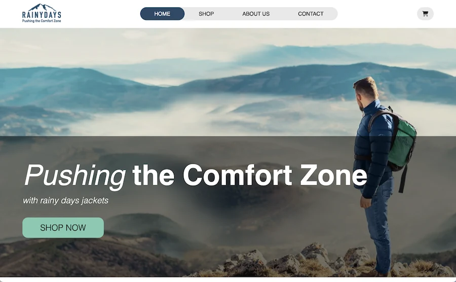

# Rainy Days



An e-commerce website for a fictional rain jacket store. This was created as part of my studies at Noroff - Frontend Development.

## 📍 Live Site

[https://norofffeu.github.io/html-css-course-assignment-KatjaTurnsek/](https://norofffeu.github.io/html-css-course-assignment-KatjaTurnsek/)

## 💻 GitHub Repository

[https://github.com/NoroffFEU/html-css-course-assignment-KatjaTurnsek](https://github.com/NoroffFEU/html-css-course-assignment-KatjaTurnsek)

## 📝 Description

Rainy Days is an online shop that allows users to browse a collection of rain jackets, view product details, and purchase items using a shopping cart system. The site is responsive and designed to be user-friendly across devices. Product data is loaded dynamically from the Noroff API.

### Key Features

- Product listing and detail pages  
- Add to cart with size selection  
- Shopping cart with quantity control and removal  
- "Added to cart" confirmation popup  
- Checkout form with client-side validation  
- Shipping cost calculation 
- "Your cart is empty" message when appropriate  
- Mobile responsive design  
- LocalStorage-based persistent cart  

## 🔧 Built With

- HTML  
- CSS  
- JavaScript  
- Noroff Rainy Days API  

## 📦 Installation

To run the project locally:

1. Clone the repository:
   ```bash
   git clone https://github.com/NoroffFEU/html-css-course-assignment-KatjaTurnsek.git
   ```
2. Open `index.html` in your browser.

> ⚠️ Note: Product data is fetched from Noroff's Rainy Days API (GET requests only, no API key needed).

## 🙋‍♀️ Author

**Katja Turnšek**  
Frontend Development Student  
[Portfolio Website](https://katjaturnsek.github.io/portfolio-noroff/)
